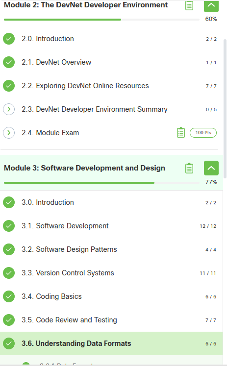
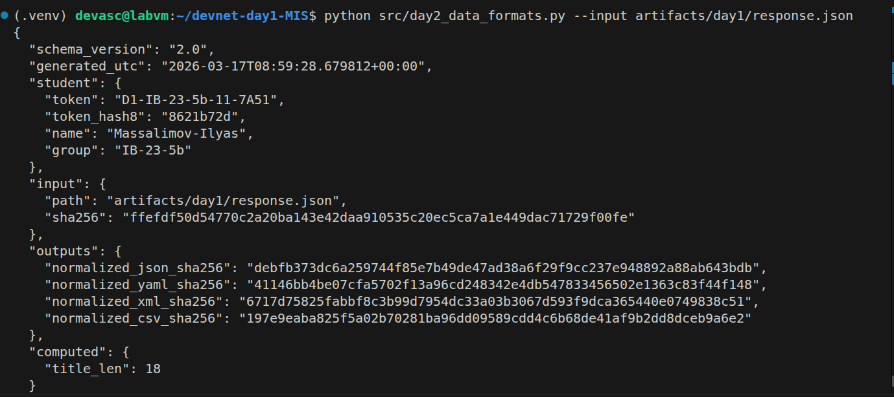
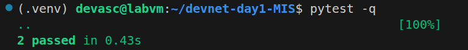

# Day 2 Report — Git + Data Formats + Tests

## 1) Student
- Name: Massalimov Ilyas
- Group: IB-23-5b
- Token: D1-IB-23-5b-11-7A51
- Repo: https://github.com/zxcsalam/devnet-day1-IB_23_5b-massalimov
- PR link (day2): (also in artifacts/day2/pr_link.txt) https://github.com/zxcsalam/devnet-day1-IB_23_5b-massalimov/pull/1

## 2) NetAcad progress
- Module 2.2 done: [Yes]
- Module 3.1–3.6 done: [Yes]




## 3) Git evidence
- File `artifacts/day2/git_log.txt` exists: [Yes]
- File `artifacts/day2/conflict_log.txt` exists: [Yes]
- Conflict note (1–2 lines): Был создан намеренный конфликт в файле report.md путём одновременного изменения одной строки в ветках feature/day2-readme-A и feature/day2-readme-B. Конфликт разрешён вручную, изменения зафиксированы мерж-коммитом cf36131.

## 4) Generated artifacts (Day2)
- normalized.json: [Yes]
- normalized.yaml: [Yes]
- normalized.xml: [Yes]
- normalized.csv: [Yes]
- summary.json: [Yes]

## 5) Commands output (paste EXACT output)
### 5.1 Generator
```text
{
  "schema_version": "2.0",
  "generated_utc": "2026-03-17T08:59:28.679812+00:00",
  "student": {
    "token": "D1-IB-23-5b-11-7A51",
    "token_hash8": "8621b72d",
    "name": "Massalimov-Ilyas",
    "group": "IB-23-5b"
  },
  "input": {
    "path": "artifacts/day1/response.json",
    "sha256": "ffefdf50d54770c2a20ba143e42daa910535c20ec5ca7a1e449dac71729f00fe"
  },
  "outputs": {
    "normalized_json_sha256": "debfb373dc6a259744f85e7b49de47ad38a6f29f9cc237e948892a88ab643bdb",
    "normalized_yaml_sha256": "41146bb4be07cfa5702f13a96cd248342e4db547833456502e1363c83f44f148",
    "normalized_xml_sha256": "6717d75825fabbf8c3b99d7954dc33a03b3067d593f9dca365440e0749838c51",
    "normalized_csv_sha256": "197e9eaba825f5a02b70281ba96dd09589cdd4c6b68de41af9b2dd8dceb9a6e2"
  },
  "computed": {
    "title_len": 18
  }
}
```

### 5.2 PyTest
```text
(.venv) devasc@labvm:~/devnet-day1-MIS$ pytest -q
..                                                  [100%]
2 passed in 0.43s
```








## 6) What i learned
Работа с ветками в Git и создание Pull Request.

Механизм возникновения и разрешения merge conflict.

Конвертация данных между форматами JSON, YAML, XML и CSV на Python.

Валидация сложных структур данных через jsonschema.

## 7) Problems & fixes
Problem: При попытке сделать git push origin master возникла ошибка rejected (fetch first), так как после мержа PR на GitHub удаленный репозиторий ушел вперед.

Fix: Выполнил git pull origin master для синхронизации локальной ветки с удаленной, после чего пуш прошел успешно.

Proof: Коммит 11089bb (Merge branch 'master' of remote).