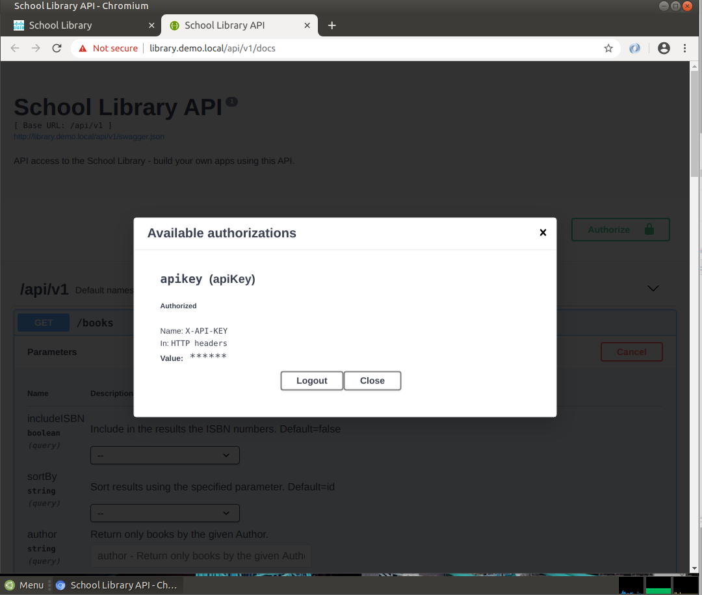
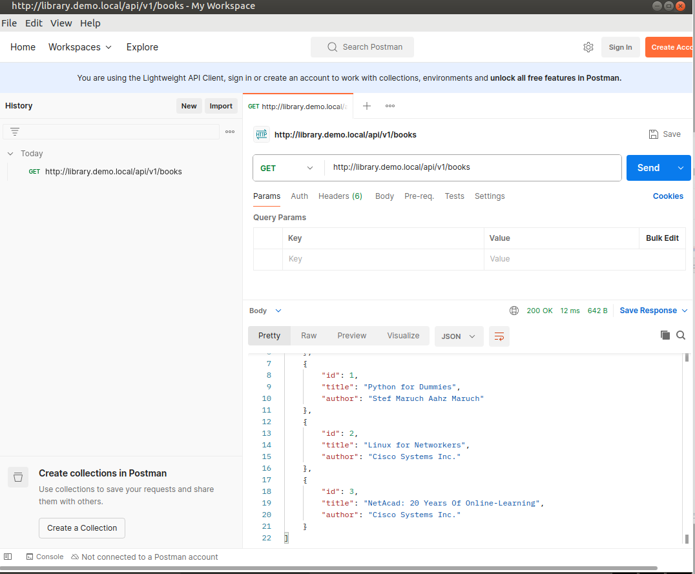
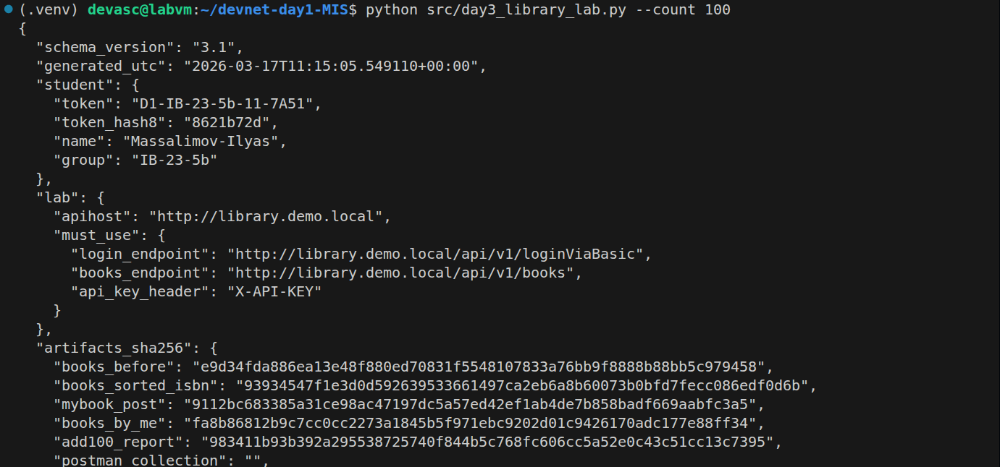
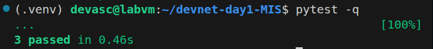

# Day 3 Report — Lab 4.5.5 + Auto-check artifacts

## 1) Student
- Name: Massalimov Ilyas
- Group: IB-23-5b
- Token: D1-IB-23-5b-11-7A51
- Repo: https://github.com/zxcsalam/devnet-day1-IB_23_5b-massalimov

## 2) Lab 4.5.5 completion evidence
- API docs (Try it out) screenshots:





- Postman screenshots:





- Python run screenshot:






## 3) Artifacts checklist
- artifacts/day3/books_before.json: [Yes]
- artifacts/day3/books_sorted_isbn.json: [Yes]
- artifacts/day3/mybook_post.json: [Yes]
- artifacts/day3/books_by_me.json: [Yes]
- artifacts/day3/add100_report.json: [Yes]
- artifacts/day3/postman_collection.json: [Yes]
- artifacts/day3/postman_environment.json: [Yes]
- artifacts/day3/curl_get_books.txt: [Yes]
- artifacts/day3/curl_get_books_isbn.txt: [Yes]
- artifacts/day3/curl_get_books_sorted.txt: [Yes]
- artifacts/day3/summary.json: [Yes]

## 4) Command outputs (paste exact)
### 4.1 Script run
```text
{
  "schema_version": "3.1",
  "generated_utc": "2026-03-17T11:15:05.549110+00:00",
  "student": {
    "token": "D1-IB-23-5b-11-7A51",
    "token_hash8": "8621b72d",
    "name": "Massalimov-Ilyas",
    "group": "IB-23-5b"
  },
  "lab": {
    "apihost": "http://library.demo.local",
    "must_use": {
      "login_endpoint": "http://library.demo.local/api/v1/loginViaBasic",
      "books_endpoint": "http://library.demo.local/api/v1/books",
      "api_key_header": "X-API-KEY"
    }
  },
  "artifacts_sha256": {
    "books_before": "e9d34fda886ea13e48f880ed70831f5548107833a76bb9f8888b88bb5c979458",
    "books_sorted_isbn": "93934547f1e3d0d592639533661497ca2eb6a8b60073b0bfd7fecc086edf0d6b",
    "mybook_post": "9112bc683385a31ce98ac47197dc5a57ed42ef1ab4de7b858badf669aabfc3a5",
    "books_by_me": "fa8b86812b9c7cc0cc2273a1845b5f971ebc9202d01c9426170adc177e88ff34",
    "add100_report": "983411b93b392a295538725740f844b5c768fc606cc5a52e0c43c51cc13c7395",
    "postman_collection": "",
    "postman_environment": "",
    "curl_get_books": "de64bae22fde03848fbeb14e2a6c661cf7e9eed12f29b574d596224bf5bf6bf9",
    "curl_get_books_isbn": "ee1093008a5d89a75d9aaf8a2c8a7987c8841bce0c4028d02d32e78f083fb227",
    "curl_get_books_sorted": "6e87e9da9e47b139ee6633b979ddefac161bd7ee3006a66118067b2b866bcef5"
  },
  "validation": {
    "must_have_mybook_title_contains_token_hash8": true,
    "must_have_added_100": true
  }
}
```

### 4.2 Tests
```text
(.venv) devasc@labvm:~/devnet-day1-MIS$ pytest -q
...                                                 [100%]
3 passed in 0.46s
```

## 5) Problems & fixes (at least 1)
Problem: Переменные окружения (.env) постоянно сбрасывались при открытии нового терминала, из-за чего скрипты выдавали ошибку.

Fix: Добавил команду export $(cat .../.env | xargs) в файл ~/.bashrc.

Proof: Теперь команда echo $STUDENT_NAME сразу выдает Massalimov-Ilyas без ручного ввода export.