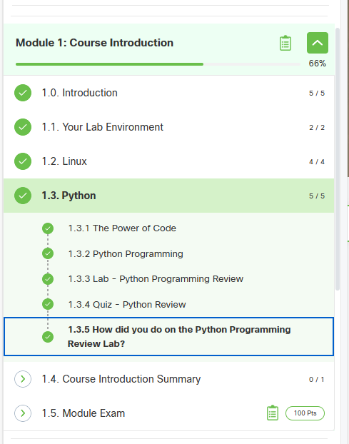
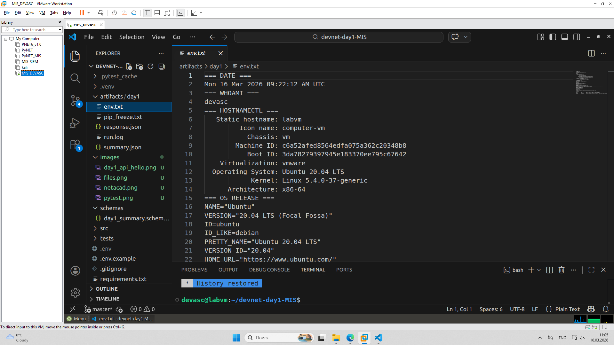
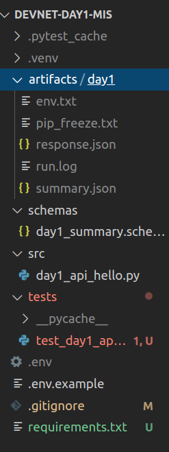
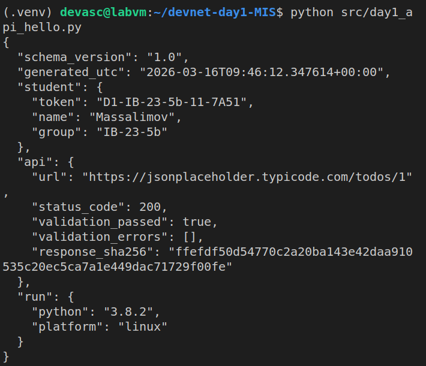
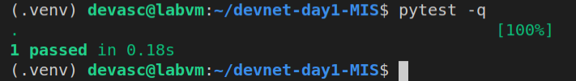

# Day 1 Report — DevNet Sprint

## 1. Student
- Name: Массалимов Ильяс
- Group: ИБ-23-5б
- GitHub repo: https://github.com/zxcsalam/devnet-day1-IB_23_5b-massalimov/tree/master
- Day1 Token: [D1-....]
```json
{
  "api": {
    "response_sha256": "ffefdf50d54770c2a20ba143e42daa910535c20ec5ca7a1e449dac71729f00fe",
    "status_code": 200,
    "url": "https://jsonplaceholder.typicode.com/todos/1",
    "validation_errors": [],
    "validation_passed": true
  },
  "generated_utc": "2026-03-16T09:49:46.613641+00:00",
  "run": {
    "platform": "linux",
    "python": "3.8.2"
  },
  "schema_version": "1.0",
  "student": {
    "group": "IB-23-5b",
    "name": "Massalimov",
    "token": "D1-IB-23-5b-11-7A51"
  }
}
```


## 2. NetAcad progress (Module 1)
- Completed items: [1.1 / 1.2 / 1.3]
- Screenshot(s): 


## 3. VM evidence
- File: `artifacts/day1/env.txt` exists: [Yes]
- Screenshot(s):


## 4. Repo structure (must match assignment)
- `src/day1_api_hello.py` : [Yes]
- `tests/test_day1_api_hello.py` : [Yes]
- `schemas/day1_summary.schema.json` : [Yes]
- `artifacts/day1/summary.json` : [Yes]
- `artifacts/day1/response.json` : [Yes]

### 5. Script run
```json
{
  "api": {
    "response_sha256": "ffefdf50d54770c2a20ba143e42daa910535c20ec5ca7a1e449dac71729f00fe",
    "status_code": 200,
    "url": "https://jsonplaceholder.typicode.com/todos/1",
    "validation_errors": [],
    "validation_passed": true
  },
  "generated_utc": "2026-03-16T09:49:46.613641+00:00",
  "run": {
    "platform": "linux",
    "python": "3.8.2"
  },
  "schema_version": "1.0",
  "student": {
    "group": "IB-23-5b",
    "name": "Massalimov",
    "token": "D1-IB-23-5b-11-7A51"
  }
}
```

## Pytest
.                                                                        [100%]
1 passed in 0.45s




### 6. Learn

Научился разворачивать рабочее окружение в DEVASC VM и работать с виртуальными средами Python venv.

Освоил валидацию данных с помощью JSON Schema для автоматической проверки структуры отчетов.

Закрепил навыки работы с Git: использование .gitignore, работу с удаленными репозиториями и важность осмысленных коммитов.

### 7. Problems

Problem: При запуске pytest возникала ошибка ModuleNotFoundError: No module named 'jsonschemaPyth'. Также VS Code не видел установленные библиотеки и подчеркивал типы list[str] красным.

Fix: Исправил опечатку в импорте. Для поддержки современного синтаксиса аннотаций типов в Python 3.8 добавил from __future__ import annotations. В VS Code сменил интерпретатор на путь из .venv, чтобы редактор подтянул установленные пакеты.